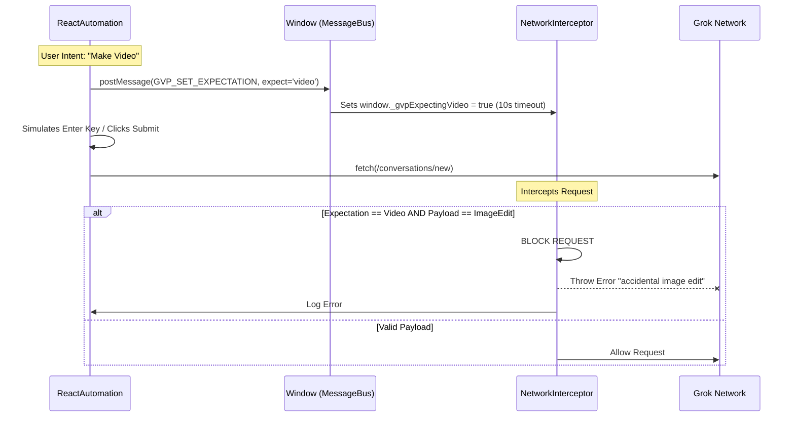

# Technical: Core Infrastructure & Feature Systems

### The Triple-Layer Defense (v1.30.2)
1. **Layer 1: Structural Segregation**: Automation uses leaf-to-container hierarchical selectors to distinguish between identical-looking UI components.
2. **Layer 2: Synchronization Heartbeats**: Mandatory 500ms delays (The 500ms Rule) ensure the SPA state settles between micro-steps.
3. **Layer 3: Network Intent Guard**: A payload-level gatekeeper in the fetch interceptor that blocks accidental destructive actions (like Image Edits during Video flows).

---

This document covers the foundational systems of the extension, including orchestration, unified storage, real-time stream handling, and core feature architectures.

---

## 1. System Architecture & Manager Pattern
The extension follows a centralized **Manager Pattern** where logic is isolated into specialized classes.

### Manager Hierarchy
- **Entry Point**: `content.js` initializes the core managers.
- **Core Orchestrators**: `UIManager`, `StateManager`, `NetworkInterceptor`.
- **Infrastructure**: `IndexedDBManager`, `StorageManager`.
- **Automation**: `ReactAutomation`, `VideoQueueManager`, `UploadAutomationManager`.

### Core Responsibilities
- **`StateManager.js`**: Single source of truth for presets, settings, and history with per-account isolation.
- **`NetworkInterceptor.js`**: Intercepts Grok API traffic (/new, /list) for tracking and response monitoring.
- **`IndexedDBManager.js`**: Handles unlimited storage for unified video history.
- **`ReactAutomation.js`**: Centralizes reliable React element interaction (`reactClick`).

---

## 2. Unified Storage & History
All video generation data (API-sourced and locally generated) is consolidated into a single IndexedDB store.

### IndexedDB Schema
- **Database**: `GrokVideoPrompter`
- **Store**: `unifiedHistory` (Primary Key: `imageId`)
- **Isolation**: Each entry includes an `accountId` to ensure data privacy between switched accounts.

### Data Flow
1. **API /list**: Ingested by `NetworkInterceptor` -> `StateManager` -> `IndexedDB`.
2. **Generation Events**: `gvpFetchInterceptor` (Page) -> `NetworkInterceptor` (Content) -> `StateManager`.
3. **Consumption**: `UIPlaylistManager` and `UIGenerationRailManager` subscribe to `StateManager` updates.

---

## 3. SSE & NDJSON Stream Handling
Grok's video generation API (`/rest/media/creation/new`) uses **Server-Sent Events (SSE)** delivering **Newline Delimited JSON (NDJSON)**.

### Extraction Pattern
The extension intercepts these streams by cloning the `fetch` response and using a `ReadableStream` reader with a buffer-aware parsing loop to handle partial lines.

```javascript
/* SPEC COMPLIANT (v1.30.0): NDJSON/SSE Parsing Loop */
async function processResponseBody(response, context) {
    const reader = response.body.getReader();
    const decoder = new TextDecoder();
    let buffer = '';

    while (true) {
        const { done, value } = await reader.read();
        if (done) break;

        buffer += decoder.decode(value, { stream: true });
        const lines = buffer.split('\n');
        buffer = lines.pop(); // Keep partial line for next chunk

        for (const line of lines) {
            if (line.trim()) {
                const json = JSON.parse(line.replace(/^data: /, ''));
                // Process each NDJSON object (progress, moderation, completion)
                window.dispatchEvent(new CustomEvent('gvp:stream-payload', { detail: json }));
            }
        }
    }
}
```

### Terminal State Detection
| State | Logic Condition | Persistence |
| :--- | :--- | :--- |
| **Progress** | `generatorProgress` between 0 and 99 | In-memory only (UI update) |
| **Success** | `generatorProgress === 100 && moderated === false` | Write to IndexedDB |
| **Moderated** | `moderated === true` | Write to IndexedDB (as failure/moderated) |
| **Error** | Stream closes before 100% or `reasonForBlocking` present | Log error, no persistence |

---

## 4. Feature Architectures

### Batch Upload Mode
Automates video generation from a local queue of files and prompts via the **Prompt Bridge Pattern**:
1. `UploadAutomationManager` sends `postMessage` with the prompt to the page context.
2. `gvpFetchInterceptor.js` catches the auto-triggered `/conversations/new` request and appends the prompt to the asset URL.

### Video Queue System
Core automation engine for batch generation across multiple images/posts.
- **VQM Logic**: `VideoQueueManager.js` handles the loop and triggers navigation via `ReactAutomation._navigateToPost`.
- **UI Grid**: `UIVideoQueueManager.js` renders a 72x72px grid of monitoring tiles.

### Gallery Quick Modes
Trigger instant actions from gallery clicks (`/imagine`, `/favorites`).
- **Spicy Mode** (🌶️): Handled via **Dual-Layer Interception** (Content Script + Injected Script). Strips custom prompt text and injects the `--mode=extremely-spicy-or-crazy` tag at the network level, ensuring parity between extension-driven and native UI generations.
- **Quick Raw/JSON**: Submits current extension prompt via TipTap.
- **Quick Queue** (📥): Intercepts click; Adds Image ID to Queue.

---

## 5. Manager API Reference

### ReactAutomation.js (Bridge Logic)
| Method | Description |
| :--- | :--- |
| `reactClick(el)` | Simulates a native React click via fiber dispatch. |
| `_setEditableValue(el, text)` | **2026 Shift**: Unified setter for both legacy `<textarea>` and TipTap `contenteditable` divs. |
| `_navigateToPost(postId)` | **Centralized Navigation**: Performs SPA page switching via `pushState` and `PopStateEvent`. |
| `sendToGenerator(prompt, isRaw)` | Injects text via `_setEditableValue` and triggers generation (/new). |

### NetworkInterceptor.js
| Method | Description |
| :--- | :--- |
| `triggerBulkGallerySync(accountId, source)` | Proactively fetches ALL gallery/favorites (limit: 5000). |
| `fetchPostDetails(postId)` | Fetches nested post metadata via `/rest/media/post/get`. |

### IndexedDBManager.js
| Method | Description |
| :--- | :--- |
| `upsertMultiGenEntry(entry)` | Saves/updates a history entry keyed by `imageId` in current session. |
| `_ingestListToUnified(posts)` | **v6/v7 Bridge**: Ingests /list API responses directly into storage. |

---

## 6. UI Sub-Manager Orchestration

The `UIManager.js` serves as the central hub for the extension's user interface, employing a nested manager pattern to handle complex UI subsystems within a **Shadow DOM** environment.

### Component Initialization
Upon creation of the Shadow Root, the `UIManager` instantiates a series of specialized sub-managers, passing required dependencies (StateManager, ReactAutomation) and the `shadowRoot` reference.

| Sub-Manager | Responsibility |
| :--- | :--- |
| **`UIStatusManager`** | Real-time status badges and progress indicators. |
| **`UITabManager`** | Navigation and content switching between major panels (RAW, JSON, History). |
| **`UIModalManager`** | Fullscreen overlays for prompt editing and configuration. |
| **`UIRawInputManager`** | Handling user text input for "Quick Mode" automation. |
| **`UIPlaylistManager`** | Orchestrating sequence playback of generated videos. |
| **`UIGenerationRailManager`** | Persistent UI element for monitoring ongoing generations across the SPA. |
| **`UIUpscaleAutomationManager`** | Specialized workflow for automating image/video upscaling tasks via UI interaction. |

### Shadow DOM Quarantine
All UI components rendered by these sub-managers are appended to the `shadowRoot`. This ensures that extension styles do not leak into the Grok site and, crucially, prevents Grok's aggressive React event listeners from interfering with the extension's own input fields and buttons.

---

## 7. SPA Navigation & Post List Indexing

To handle Grok's Single Page Application (SPA) architecture, GVP manages its own re-indexing and internal navigation triggers to enable "super fast" travel between image posts.

### Post List Re-indexing
Instead of simple index lookups, GVP uses a recursive search pattern to handle nested post structures (parent/child/images/videos) within the `unifiedHistory`.

### Fast Travel (SPA Navigation)
Directly updating `window.location` is avoided as it triggers a full browser reload. Instead, GVP uses the `History API`:
1.  `window.history.pushState({}, '', targetUrl)` updates the address bar.
2.  `window.dispatchEvent(new PopStateEvent('popstate'))` notifies Grok's internal React router to perform a soft transition.

### Sequential Flow Control
To avoid React state reconciliation conflicts during multi-step automation (e.g., Generate -> Move Next), a 1.0 - 1.5s buffer delay is implemented between injection and navigation.

---

## 8. Network Guard: Triple-Layer Defense (v1.30.2)
To neutralize risks from Grok's ambiguous 2026 UI (identical buttons for "Make Video" and "Edit Image"), GVP implements a **Triple-Layer Defense** architecture, augmented by a **Modal-Context Guard** in v1.60.9x.

### 🛡️ Layer 4: Modal-Context Guard (v1.60.9x)
To eliminate multi-fire race conditions during carousel navigation, GVP uses a DOM-context guard. Clicks originating from within the Image Edit modal (`div[role="dialog"]`) are explicitly ignored by the QuickLaunch manager, preventing thumbnails from being misidentified as gallery cards.

```javascript
/* v1.60.9x Modal-Context Guard */
const isInsideModal = e.composedPath().some(el => 
    el instanceof HTMLElement && el.getAttribute('role') === 'dialog'
);
if (isInsideModal) return; 
```

### Layer 1: Structural Segregation (UI)
Automation uses ultra-specific, hierarchical selectors (leaf-to-container) to distinguish between Video and Image Edit menu items, even when they share CSS classes.

### Layer 2: Synchronization Heartbeats (Logic)
A strict **500ms Rule** is enforced between every micro-step in the video generation fallback (e.g., between "Switch to Video Mode" and "Set Prompt"). This allows the SPA state to stabilize and prevents race conditions.

### Layer 3: Network Intent Guard (Final Safeguard)
Implemented in `gvpFetchInterceptor.js`, this layer performs payload-level inspection as a final "ground truth" check.

#### The Expectation Signal (ReactAutomation.js)
Before triggering submission (via simulated Enter key), `ReactAutomation.js` sends an intent signal to the page context. This ensures the interceptor knows exactly what type of generation is intended.

```javascript
window.postMessage({
    source: 'gvp-extension',
    type: 'GVP_SET_EXPECTATION',
    payload: { expect: 'video' }
}, '*');
```

#### The Gatekeeper (gvpFetchInterceptor.js)
The fetch interceptor overrides the native `window.fetch` and monitors requests to `/rest/app-chat/conversations/new`.

- **Arming**: When the `GVP_SET_EXPECTATION` message is received, a global flag `window._gvpExpectingVideo` is set to `true`.
- **Auto-Reset**: A 10-second `setTimeout` applies a fail-safe reset to prevent permanent blocking.
- **The Blockade**: Performs a "belt-and-suspenders" payload inspection. If any of the following signals are detected when video is expected, the request is **BLOCKED**:
    - `modelName === "imagine-image-edit"`
    - `toolOverrides.imageGen === true`
    - `enableImageGeneration === true` (detected in v1.30.2 cleanup)
- **Error Propagation**: Throws a loud `Error: 🛑 GVP NETWORK GUARD: BLOCKED ACCIDENTAL IMAGE EDIT.` and resets the expectation flag.
- **Architectural Rational (Surgical Placement)**: The guard is armed specifically in the `ReactAutomation.js` **fallback path** (Settings -> Menu -> Make Video). The primary path uses a visual gatekeeper (Make Video button presence), but the fallback path carries the highest risk of Radix menu ambiguity, requiring the secondary network-level blockade.
- **Defense-in-Depth Gap (Identified v1.30.2 Audit)**: The primary `sendToGenerator` path (direct button click) currently lacks the Network Guard signal. While it has a DOM-level gatekeeper, it is susceptible to "cooked" UI states where image-edit buttons might impersonate video-gen buttons, bypassing the visual check. Universal arming for both paths is the recommended path forward.

#### Sequence Diagram


---

## 9. Quick Raw & Quick JSON Flow Analysis

This section provides a deep-dive trace of the "Quick Raw" (and Quick JSON) automation flow, identifying the path from user interaction to network submission.

### 9.1 Flow Entry Points

#### Content Script (content.js)
The primary entry point for Quick Raw triggered from gallery clicks (`/imagine`, `/favorites`):
- **L1411-1495 (`_processPendingPayload`)**:
    - Restoration of payload from `sessionStorage`.
    - Verification of `targetPath` and `imageId` alignment.
    - **Delegation**:
        - If `!payload.isRaw` -> `UIManager.uiFormManager.handleGenerateJson()`.
        - If `payload.isRaw` -> `UIManager.uiRawInputManager.handleGenerateRaw()`.
        - **Fallback (L1487)**: Calls `ReactAutomation.sendToGenerator()` directly if handlers are unavailable.

#### UI Manager (UIManager.js)
The entry point for navigation-based quick modes or sidebar launcher clicks:
- **`_applyActiveQuickMode` (L2607-2659)**:
    - Checks `getQuickLaunchMode()` (State: `ui.quickLaunchMode`).
    - **Dispatch**:
        - `mode === 'raw'` -> `uiRawInputManager.handleGenerateRaw()`.
        - `mode === 'json'` -> `uiFormManager.handleGenerateJson()`.

### 9.2 Automation Sub-Managers

#### UIRawInputManager.js
- **`handleGenerateRaw` (L1368-1407)**:
    - Builds the prompt (or uses override).
    - Calls **`this.reactAutomation.sendToGenerator(processedPrompt, true)`**.

#### UIFormManager.js
- **`handleGenerateJson` (L1740)**:
    - Builds JSON prompt.
    - Calls **`this.reactAutomation.sendToGenerator(promptJson, false)`**.

### 9.3 The Execution Engine (ReactAutomation.js)

`sendToGenerator(promptText, isRaw)` is the final common path for all video generation modes (Quick Raw, Quick JSON, Playlist, Queue).

#### Path A: Primary (Direct Click)
1. **L191-204**: Locates Input (TipTap).
2. **L206-222**: **DOM Gatekeeper**. Verifies `Make Video` button presence.
3. **L227-238**: Injects Value.
4. **L256-260**: Submits via **Enter Key**.
5. **CRITICAL GAP**: No `GVP_SET_EXPECTATION` signal is sent in this path. It relies entirely on the button check.

#### Path B: Fallback (Settings Menu)
Triggered if the direct button is missing (common on fresh image posts).
1. **L305-314**: Clicks Settings Gear.
2. **L323-344**: Clicks "Make Video" from Radix menu.
3. **L353-356**: Locates Input.
4. **L369-377**: **GUARD ARMING**. Sends `GVP_SET_EXPECTATION` (expect: 'video').
5. **L382-386**: Submits via **Enter Key**.
6. **L390-401**: Redundant Submit Button click (arms guard again at L394).

### 9.4 Key Architectural Risks (Identified v1.30.2 Audit)

1. **"Cooked" UI Ambiguity**: If Grok alters the Image Edit button classes or labels to match Video Gen (or if the user is in a state where only Image Edit exists), the Primary Path's DOM check (L215) might false-positive, leading to an unwanted image edit without the Network Guard being armed to block it.
2. **Universal Guarding**: The current architecture "surgically" guards only the High-Risk Fallback path. A robust "Defense-in-Depth" strategy requires arming the guard at the start of `sendToGenerator` regardless of the chosen path.
3. **Quick Raw Parity**: Quick Raw is effectively a wrapper around the Primary path. If Quick Raw is used on a page where the Video mode hasn't been set, and the DOM check fails, it will attempt the Fallback path (which is guarded). If the DOM check *succeeds* wrongly, it fails to arm the guard.
---

## 10. Grok Image URL Taxonomy

This section catalogs the various image URL structures used by Grok (x.ai) as detected during the GVP extension adaptation.

### 10.1 Generated Assets (Standard)
These are images created by Grok's image generation model.
*   **Structure**: `https://assets.grok.com/users/{userId}/generated/{imageId}/image.jpg` (or variations with `?cache=1`)
*   **Key Insight**: The `userId` is typically the first UUID and the `imageId` is the second. GVP often relies on the second UUID for post-linking.

### 10.2 Public / Shared Assets (New 2026)
Used for shared posts and public image URLs.
*   **Structure (User Uploads)**: `https://imagine-public.x.ai/imagine-public/share-images/{uuid}.png` (Often via `cdn-cgi` path)
*   **Structure (Generated)**: `https://imagine-public.x.ai/imagine-public/images/{uuid}.jpg`
*   **Evolution**: GVP v1.30.0 was updated to support this domain for "Clean Spicy" mode stripping.

### 10.3 Account / User Uploaded Assets
These often appear when a user uploads an image or for internal asset references.
*   **Structure**: `https://assets.grok.com/users/{userId}/{assetId}/content`
*   **Context**: Often used in multi-generation gallery syncs or when referencing specific user-uploaded context images.

---

## 11. UI Ambiguity & Intent Ground Truth

Due to high degree of structural similarity between "Video Generation" and "Image Editing" in the 2026 UI, precise classification is required.

### 11.1 Flow Comparison Matrix
| Feature | Video Generation (Quick Raw) | Image Edit (Image Mode) |
| :--- | :--- | :--- |
| **Primary Trigger** | "Make Video" Menu Item | "Edit Image" Menu Item |
| **Submit Button Label** | `aria-label="Make video"` or `"Submit"` | `aria-label="Edit"` |
| **Payload `modelName`** | `grok-3` | `imagine-image-edit` |
| **Payload `toolOverrides`** | `videoGen: true` | `imageGen: true` |

### 11.2 The "Cooked" UI State
Grok's overhaul utilizes nearly identical components, shared CSS classes, and even shared SVG paths for fundamentally different operations.
- **Button Impersonation**: A generic button with a "play" icon for video can look identical to a "brush/pencil" icon for editing in terms of wrapper classes.
- **Menu Ambiguity**: The "Make Video" and "Edit Image" options in Radix menus look identical in structure, differing only by text content.

---

## 12. Grok Interaction Recorder Utility

The **Grok Interaction Recorder** is a diagnostic Tampermonkey userscript developed to trace UI interactions, capture DOM selectors, and document automation flows.

### 12.1 Core Logic
The tool injects a persistent UI button (`🔴 Rec`) that intercepts all click events. It extracts:
- `ariaLabel`: To distinguish identical buttons.
- `role`: To identify Radix menu items.
- `html`: Full `outerHTML` for structural analysis.
- `classes`: Dot-separated class list for CSS selector generation.

### 12.2 Implementation Trace
The resulting JSON export maps:
`PRE_STATE (DOM)` -> `INTERACTION (Selector/Key)` -> `POST_STATE (DOM)` -> `NETWORK_SENT (JSON)`.

---

## 13. Grok Interaction Mission Taxonomy

This defines the comprehensive set of interaction scenarios required to fully map the Grok UI and feed the Guided Workflow Recorder.

### 13.1 Scenario Categories
1.  **Imagine-Generated Assets**:
    - **IMG-V-EDIT**: WITH Video -> Image Edit Mode.
    - **IMG-V-GEN**: WITH Video -> Video Gen Mode.
    - **IMG-NV-EDIT**: WITHOUT Video -> Image Edit Mode.
    - **IMG-NV-GEN**: WITHOUT Video -> Video Gen Mode.
2.  **User-Uploaded Assets**:
    - **UL-V-EDIT**: WITH Video -> Image Edit Mode.
    - **UL-V-GEN**: WITH Video -> Video Gen Mode.
    - **UL-NV-EDIT**: WITHOUT Video -> Image Edit Mode.
    - **UL-NV-GEN**: WITHOUT Video -> Video Gen Mode.
3.  **Gallery Carousel**:
    - **GAL-CARO**: Card with history -> Enter Edit Mode -> Click Carousel Thumbnails.
